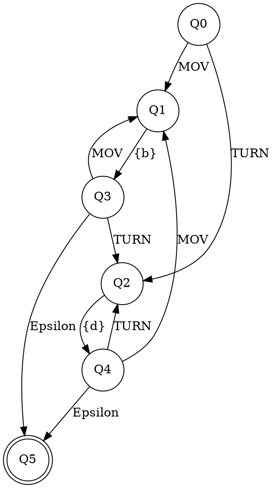

# 🤖 ITESM Robot Language Compiler

## 🎯 Descripción general

Este proyecto tiene como objetivo modelar el comportamiento de un robot autónomo que se desplaza sobre una matriz bidimensional (10x10), utilizando principios de **lenguajes formales** y **autómatas finitos**.

La propuesta se divide en dos entregables complementarios:

1. **Simulador de CPU del Robot**: Ejecución de instrucciones en lenguaje ensamblador personalizado (.asm).
2. **Compilador de lenguaje educado**: Traductor de frases naturales como "Could you kindly move 3 blocks ahead?" a instrucciones `.asm` válidas para el robot.

Este enfoque combina teoría de la computación, análisis sintáctico y semántico, e implementación práctica en Python, Lex y Yacc.

---
## Autores:

- Liliana Ramos Vázquez A01644969
- Diana Fernanda Delgado Salcedo A01644911
- Luis Fernando Díaz Hernández A01639435


---

## 👥 Autores

* Liliana Ramos Vázquez - A01644969
* Diana Fernanda Delgado Salcedo - A01644911
* Luis Fernando Díaz Hernández - A01639435

Repositorio: [github.com/luisdh8/robot-language-compiler](https://github.com/luisdh8/robot-language-compiler)

---

## 🔎 Entregable 1: Simulador del CPU del Robot

### 📅 Descripción

Se construyó un simulador de instrucciones tipo ensamblador con instrucciones `MOV,<n>` y `TURN,<d>`, interpretadas por una **máquina de estados no determinista (NFA)** y una **máquina de orientación (DFA)**.

### 📊 Lógica de funcionamiento

* El robot inicia en la posición `(5,5)` de una matriz `10x10`, apuntando hacia el **norte**.
* Instrucciones se leen desde un archivo `instructions.asm`.
* Cada instrucción pasa por:

  * Validación del NFA principal.
  * Cálculo de nueva posición (MOV) o dirección (TURN).
  * Simulación en consola (visualización de matriz).

### 🔄 Máquina de estados principal (NFA)

Máquina de estados principal (NFA de instrucciones)

Este autómata finito no determinista (NFA) representa la lógica que valida y ejecuta las instrucciones que recibe el robot. Esta máquina valida secuencias como:

- MOV, 2

- TURN, 90

- MOV, 1


#### 📈 Su estructura es la siguiente:




Cada instrucción es reconocida por esta máquina como un conjunto de pasos válidos. Acepta múltiples combinaciones de MOV y TURN, y finaliza en un estado de aceptación (Q5) al completar la secuencia.

📐 Tupla del NFA que modela el CPU:

+ Q = {Q0, Q1, Q2, Q3, Q4, Q5}

+ Σ = {MOV, TURN, {b}, {d}}

  + {b} = {0, 1, 2, 3, 4, 5, 6, 7, 8, 9} (número de bloques)

  + {d} = {90, 180, 270, 360} (grados de giro)

+ q₀ = Q0

+ F = {Q5}

+ δ = representado por las transiciones en el diagrama

### 🌍 Máquina de orientación (DFA)

Para poder validar que efectivamente el robot no solo se esté moviendo, sino también verificar la orientación a la que se dirigirá después de un TURN, fue necesaria la implementación de una segunda máquina de estados determinista (DFA), que simula los giros en sentido horario y traduce el lenguaje de un 'TURN {d}' en un cambio de estado que representa la nueva dirección que se tomará.

📈 Su estructura es la siguiente:


```
digraph Orientation {
  rankdir=LR;
  node [shape=circle];

  DN -> DE [label="TURN,90"];
  DN -> DS [label="TURN,180"];
  DN -> DW [label="TURN,270"];
  DN -> DN [label="TURN,360"];

  DE -> DS [label="TURN,90"];
  DE -> DW [label="TURN,180"];
  DE -> DN [label="TURN,270"];
  DE -> DE [label="TURN,360"];

  DS -> DW [label="TURN,90"];
  DS -> DN [label="TURN,180"];
  DS -> DE [label="TURN,270"];
  DS -> DS [label="TURN,360"];

  DW -> DN [label="TURN,90"];
  DW -> DE [label="TURN,180"];
  DW -> DS [label="TURN,270"];
  DW -> DW [label="TURN,360"];

  DN [shape=doublecircle];
  DE [shape=doublecircle];
  DS [shape=doublecircle];
  DW [shape=doublecircle];
}
```

🧭 Estados:

- DN = Norte

- DE = Este

- DS = Sur

- DW = Oeste
- 
```

---

## 📆 Entregable 2: Compilador de lenguaje educado

### 📄 Descripción

Se desarrolló un compilador (Lex + Yacc) que convierte frases como:

```txt
Could you kindly move 3 blocks ahead, then turn 90 degrees
```

En instrucciones `.asm` como:

```asm
MOV,3
TURN,90
```

### 🔒 Tokens definidos en Lex

El archivo `robot.l` reconoce y clasifica las palabras clave, estructuras gramaticales y parámetros numéricos. Algunos tokens definidos:

| Token               | Descripción                 | Ejemplo               |
| ------------------- | --------------------------- | --------------------- |
| `NOUN`              | Sujeto del comando          | Robot, AI, Thing      |
| `PRONOUN`           | Pronombre                   | You                   |
| `COURTESY`          | Palabra de cortesía         | Could, Kindly, Please |
| `MOVE_VERB`         | Verbo de movimiento         | Move                  |
| `TURN_VERB`         | Verbo de rotación           | Turn                  |
| `NUMBER`            | Cantidad de bloques         | 1, 2, 3...            |
| `DEGREE`            | Grados de giro              | 90, 180, 270, 360     |
| `BLOCKS`, `DEGREES` | Unidades                    | blocks, degrees       |
| `AHEAD`             | Dirección válida            | ahead                 |
| `INVALID_DIRECTION` | Direcciones no permitidas   | right, left, behind   |
| `AND`, `THEN`       | Conectores de frases        | and, then             |
| `ADVERBIAL`         | Modificadores no esenciales | now, quickly, kindly  |
| `COMMA`             | Separador                   | ,                     |
| `EOL`               | Fin de línea                | \n                    |

### 📖 CFG (Context-Free Grammar) en Yacc

El archivo `robot.y` define una gramática libre de contexto no ambigua que permite múltiples formas corteses y encadenadas. Se aceptan frases como:

```
Robot please move 3 blocks ahead
Could you kindly move 2 blocks ahead, then turn 90 degrees
```

#### Árbol general de la gramática:

```
sentence
├── command
│   ├── polite_move | polite_turn
│   └── polite_X connector simple_Y
├── courtesy_opener
│   ├── NOUN COURTESY [PRONOUN]
│   └── COURTESY [PRONOUN] [COURTESY]
├── simple_move / simple_turn
└── optional adverbials
```

Se emite como salida un archivo `instructions.asm` con instrucciones ensamblador simples que son ejecutadas por el simulador `cpu.py`.

---

## ✅ Ejemplos aceptados

| Instrucción en lenguaje educado                          | Traducción (instructions.asm) |
| -------------------------------------------------------- | ----------------------------- |
| Robot please move 3 blocks ahead                         | MOV,3                         |
| Could you turn 90 degrees                                | TURN,90                       |
| Robot could you move 2 blocks ahead and turn 180 degrees | MOV,2 <br> TURN,180           |
| Please move 1 blocks ahead, then turn 270 degrees        | MOV,1 <br> TURN,270           |

---

## ❌ Ejemplos rechazados

| Instrucción                              | Motivo de rechazo                |
| ---------------------------------------- | -------------------------------- |
| Robot moves 2 blocks                     | Verbo mal conjugado              |
| Robot moves 2 blocks quickly             | Falta de estructura cortés       |
| Move 2 blocks right now                  | No inicia con sujeto o cortesía  |
| Robot 2 blocks moves                     | Orden gramatical inválido        |
| Move robot 2 blocks and turns 89 degrees | Turno no válido (89 no aceptado) |

---

## 📂 Estructura del Proyecto

```
robot-language-compiler/
├── cpu.py               # Simulador de CPU (Python)
├── test_cpu.py          # Pruebas del simulador
├── robot.l              # Archivo Lex
├── robot.y              # Archivo Yacc
├── full_test.py         # Compilador completo (E2)
├── instructions.asm     # Archivo intermedio compilado
├── robot.tab.[ch]       # Archivos Yacc generados
├── lex.yy.c             # Archivo Lex generado
└── README.md            # Este archivo
```

---

## 🛠️ Instalación y Ejecución

### 🔧 Requisitos

* Python 3.x
* Flex y Bison
* GCC (compilador de C)

### 🔍 Instalación rápida

```bash
sudo apt install flex bison gcc python3
```

### 📚 Simulador CPU

```bash
python3 test_cpu.py
```

### 🔄 Compilador natural completo

```bash
python3 full_test.py
```

---

## 🔺 Output esperado

```
Building compiler...
✅ Compiler built successfully!

=== Test 1 ===
Natural Language: Robot please move 3 blocks ahead
✅ Compiled: 'Robot please move 3 blocks ahead'
Generated Assembly:
MOV,3
# Compilation successful.

CPU Execution:
Initial state:
. . . . . . . . . .
. . . . . . . . . .
. . . . . . . . . .
. . . . . . . . . .
. . . . . . . . . .
. . . . . N . . . .
. . . . . . . . . .
. . . . . . . . . .
. . . . . . . . . .
. . . . . . . . . .
Robot at (5,5) facing N
-------------------
Executing: MOV,3
. . . . . . . . . .
. . . . . . . . . .
. . . . . N . . . .
. . . . . . . . . .
. . . . . . . . . .
. . . . . . . . . .
. . . . . . . . . .
. . . . . . . . . .
. . . . . . . . . .
. . . . . . . . . .
Robot at (5,2) facing N
-------------------
Final state accepted: True
--------------------------------------------------

=== Test 2 ===
Natural Language: Could you turn 90 degrees
✅ Compiled: 'Could you turn 90 degrees'
Generated Assembly:
TURN,90
# Compilation successful.

CPU Execution:
Initial state:
. . . . . . . . . .
. . . . . . . . . .
. . . . . . . . . .
. . . . . . . . . .
. . . . . . . . . .
. . . . . N . . . .
. . . . . . . . . .
. . . . . . . . . .
. . . . . . . . . .
. . . . . . . . . .
Robot at (5,5) facing N
-------------------
Executing: TURN,90
. . . . . . . . . .
. . . . . . . . . .
. . . . . . . . . .
. . . . . . . . . .
. . . . . . . . . .
. . . . . E . . . .
. . . . . . . . . .
. . . . . . . . . .
. . . . . . . . . .
. . . . . . . . . .
Robot at (5,5) facing E
-------------------
Final state accepted: True
--------------------------------------------------

=== Test 3 ===
Natural Language: Robot could you move 2 blocks ahead and turn 180 degrees
✅ Compiled: 'Robot could you move 2 blocks ahead and turn 180 degrees'
Generated Assembly:
MOV,2
TURN,180
# Compilation successful.

CPU Execution:
Initial state:
. . . . . . . . . .
. . . . . . . . . .
. . . . . . . . . .
. . . . . . . . . .
. . . . . . . . . .
. . . . . N . . . .
. . . . . . . . . .
. . . . . . . . . .
. . . . . . . . . .
. . . . . . . . . .
Robot at (5,5) facing N
-------------------
Executing: MOV,2
. . . . . . . . . .
. . . . . . . . . .
. . . . . . . . . .
. . . . . N . . . .
. . . . . . . . . .
. . . . . . . . . .
. . . . . . . . . .
. . . . . . . . . .
. . . . . . . . . .
. . . . . . . . . .
Robot at (5,3) facing N
-------------------
Executing: TURN,180
. . . . . . . . . .
. . . . . . . . . .
. . . . . . . . . .
. . . . . S . . . .
. . . . . . . . . .
. . . . . . . . . .
. . . . . . . . . .
. . . . . . . . . .
. . . . . . . . . .
. . . . . . . . . .
Robot at (5,3) facing S
-------------------
Final state accepted: True
--------------------------------------------------

=== Test 4 ===
Natural Language: Please move 1 blocks ahead, then turn 270 degrees
✅ Compiled: 'Please move 1 blocks ahead, then turn 270 degrees'
Generated Assembly:
MOV,1
TURN,270
# Compilation successful.

CPU Execution:
Initial state:
. . . . . . . . . .
. . . . . . . . . .
. . . . . . . . . .
. . . . . . . . . .
. . . . . . . . . .
. . . . . N . . . .
. . . . . . . . . .
. . . . . . . . . .
. . . . . . . . . .
. . . . . . . . . .
Robot at (5,5) facing N
-------------------
Executing: MOV,1
. . . . . . . . . .
. . . . . . . . . .
. . . . . . . . . .
. . . . . . . . . .
. . . . . N . . . .
. . . . . . . . . .
. . . . . . . . . .
. . . . . . . . . .
. . . . . . . . . .
. . . . . . . . . .
Robot at (5,4) facing N
-------------------
Executing: TURN,270
. . . . . . . . . .
. . . . . . . . . .
. . . . . . . . . .
. . . . . . . . . .
. . . . . W . . . .
. . . . . . . . . .
. . . . . . . . . .
. . . . . . . . . .
. . . . . . . . . .
. . . . . . . . . .
Robot at (5,4) facing W
-------------------
Final state accepted: True
--------------------------------------------------
```

<<<<<<< HEAD
## 📂 Archivos relevantes
- ```cpu.py```	Implementa el simulador y autómatas en Python.
- ```test_cpu.py```	Script de prueba e impresión del estado del robot.
- ```instructions.asm```	Archivo de entrada con instrucciones en ensamblador.
=======
---

## 🏦 Modelo pedagógico

Este proyecto sigue el enfoque POL (Project-Oriented Learning), integrando:

* Teoría de la computación
* Autómatas finitos
* Procesamiento de lenguaje natural (básico)
* Simulación e interpretación

---
>>>>>>> 8d8a5e879983bca52fecb8d40f343273edfe2a9a
