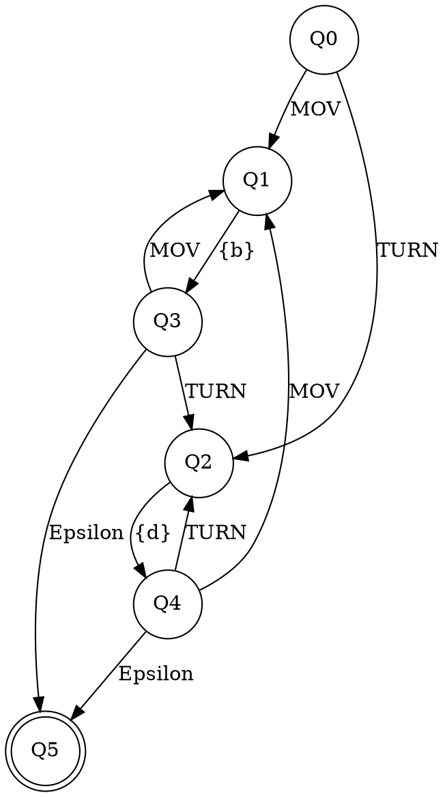

# 🧠 Simulador del CPU del Robot

## 📌 Descripción del problema

La Industria 4.0 ha dado paso a una nueva era de manufactura inteligente, donde la automatización, el intercambio de datos y los sistemas ciberfísicos están revolucionando los procesos de producción. En este contexto, los robots juegan un papel fundamental en las fábricas inteligentes, y con ello surge la necesidad de contar con lenguajes de programación especializados para su control.

Este proyecto tiene como objetivo simular el comportamiento de un robot autónomo sencillo que se desplaza en una cuadrícula bidimensional. La meta es modelar el funcionamiento del CPU del robot utilizando teoría de lenguajes formales (autómatas finitos) y, posteriormente, desarrollar un lenguaje educado específico para su programación.

---

## 📂 Repositorio de Github con el proyecto

https://github.com/luisdh8/robot-language-compiler

---

## 🔄 Diagrama del autómata que definirá la lógica del CPU (usando Graphviz)

El simulador no solo valida y ejecuta instrucciones, sino que simula el comportamiento interno del CPU del robot, empleando dos máquinas de estados distintas, cada una con responsabilidades específicas.

---

### 1️⃣ Máquina de estados principal (NFA de instrucciones)

Este autómata finito no determinista (NFA) representa la lógica que valida y ejecuta las instrucciones que recibe el robot. Esta máquina valida secuencias como:

- MOV, 2

- TURN, 90

- MOV, 1


#### 📈 Su estructura es la siguiente:




Cada instrucción es reconocida por esta máquina como un conjunto de pasos válidos. Acepta múltiples combinaciones de MOV y TURN, y finaliza en un estado de aceptación (Q5) al completar la secuencia.

📐 Tupla del NFA que modela el CPU:

+ Q = {Q0, Q1, Q2, Q3, Q4, Q5}

+ Σ = {MOV, TURN, {b}, {d}}

  + {b} = {0, 1, 2, 3, 4, 5, 6, 7, 8, 9} (número de bloques)

  + {d} = {90, 180, 270, 360} (grados de giro)

+ q₀ = Q0

+ F = {Q5}

+ δ = representado por las transiciones en el diagrama

### 2️⃣ Máquina de estados de orientación (DFA de rotación)
Para poder validar que efectivamente el robot no solo se esté moviendo, sino también verificar la orientación a la que se dirigirá después de un TURN, fue necesaria la implementación de una segunda máquina de estados determinista (DFA), que simula los giros en sentido horario y traduce el lenguaje de un 'TURN {d}' en un cambio de estado que representa la nueva dirección que se tomará.

📈 Su estructura es la siguiente:


```
digraph Orientation {
  rankdir=LR;
  node [shape=circle];

  DN -> DE [label="TURN,90"];
  DN -> DS [label="TURN,180"];
  DN -> DW [label="TURN,270"];
  DN -> DN [label="TURN,360"];

  DE -> DS [label="TURN,90"];
  DE -> DW [label="TURN,180"];
  DE -> DN [label="TURN,270"];
  DE -> DE [label="TURN,360"];

  DS -> DW [label="TURN,90"];
  DS -> DN [label="TURN,180"];
  DS -> DE [label="TURN,270"];
  DS -> DS [label="TURN,360"];

  DW -> DN [label="TURN,90"];
  DW -> DE [label="TURN,180"];
  DW -> DS [label="TURN,270"];
  DW -> DW [label="TURN,360"];

  DN [shape=doublecircle];
  DE [shape=doublecircle];
  DS [shape=doublecircle];
  DW [shape=doublecircle];
}
```

🧭 Estados:

- DN = Norte

- DE = Este

- DS = Sur

- DW = Oeste

---

## 🧪 Lógica de simulación
- El robot inicia en la posición ```(5, 5)``` mirando al norte.
- Las instrucciones válidas se leen desde un archivo ```.asm``` (una por línea).
- El simulador avanza instrucción por instrucción:
  - Si es ```MOV,n``` verifica que no salga de la matriz.
  - Si es ```TURN,d```, actualiza la orientación.

---

## 🛠️ Instrucciones de Instalación

1. **Clonar el repositorio**

```bash
git clone https://github.com/luisdh8/robot-language-compiler.git
cd robot-language-compiler
```

2. **Ejecutar el programa**
```bash
python test_cpu.py
```

---

## ✅ Output esperado

```
Initial state:
. . . . . . . . . .
. . . . . . . . . .
. . . . . . . . . .
. . . . . . . . . .
. . . . . . . . . .
. . . . . N . . . .
. . . . . . . . . .
. . . . . . . . . .
. . . . . . . . . .
. . . . . . . . . .
Robot at (5,5) facing N
-------------------
Instruction: mov,2
. . . . . . . . . .
. . . . . . . . . .
. . . . . . . . . .
. . . . . N . . . .
. . . . . . . . . .
. . . . . . . . . .
. . . . . . . . . .
. . . . . . . . . .
. . . . . . . . . .
. . . . . . . . . .
Robot at (5,3) facing N
-------------------
Instruction: turn,90
. . . . . . . . . .
. . . . . . . . . .
. . . . . . . . . .
. . . . . E . . . .
. . . . . . . . . .
. . . . . . . . . .
. . . . . . . . . .
. . . . . . . . . .
. . . . . . . . . .
. . . . . . . . . .
Robot at (5,3) facing E
-------------------
Instruction: mov,4
. . . . . . . . . .
. . . . . . . . . .
. . . . . . . . . .
. . . . . . . . . E
. . . . . . . . . .
. . . . . . . . . .
. . . . . . . . . .
. . . . . . . . . .
. . . . . . . . . .
. . . . . . . . . .
Robot at (9,3) facing E
-------------------
Instruction: mov,2
Test failed: Illegal move: out of bounds
```

## 📂 Archivos relevantes
- ```cpu.py```	Implementa el simulador y autómatas en Python.
- ```test_cpu.py```	Script de prueba e impresión del estado del robot.
- ```instructions.asm```	Archivo de entrada con instrucciones en ensamblador.
